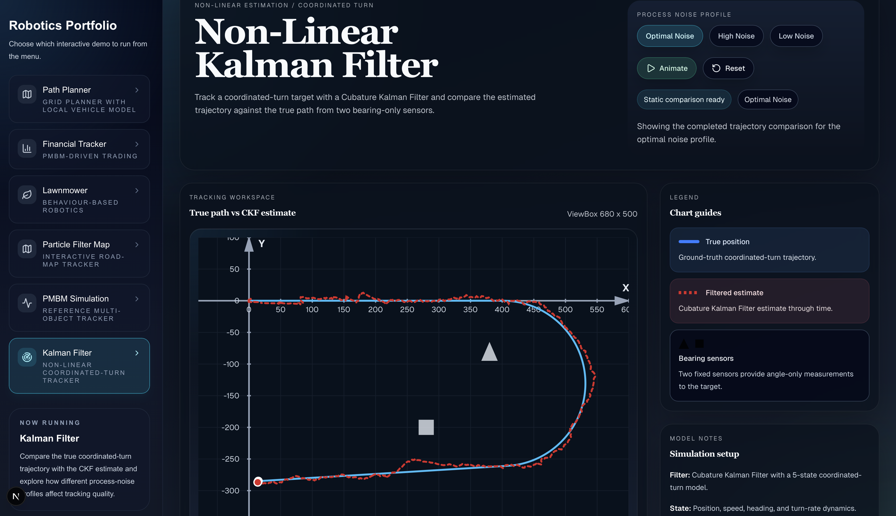
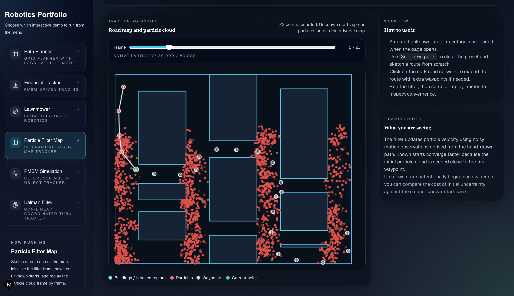
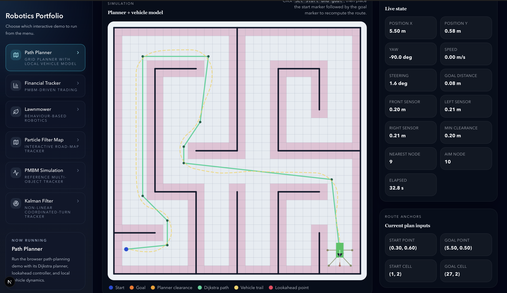
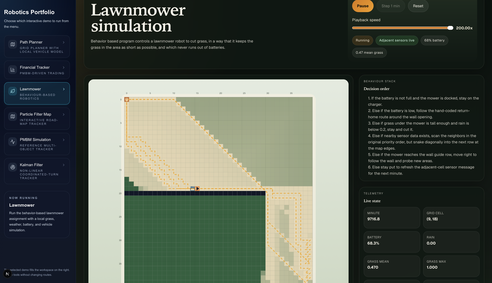
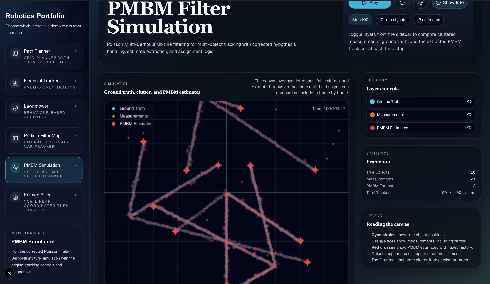
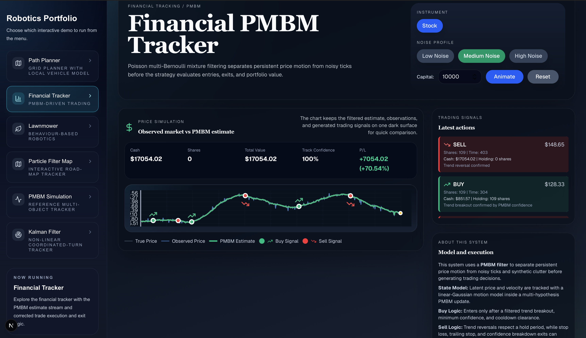

# 
  Portfolio projects in robotics  

In this repository share the **source code** of some projects of my recent courses.

Hope this might be useful to someone! :-) 

Click the pictures to see the details of the projects. The certificates are at the bottom of this page.

## Overview
### Main Project
Main project is a self driving car in virtual environment. Physical equivalent is under development.
      

           
            Main project - self driving car
            <a href="./main_project" name="Code in C++ and Python/OpenCV">(Description and C++ and Python/OpenCV code)</a>
      

      
### Smaller projects

<table style="width:100%">
  <tr>
    <th>

           
            Project 2
            Cubature Kalman Filter
            <a href="./project_2" name="p2_code">(Description and Matlab code)</a>
        

    </th>
    <th>

           
            Project 3
            Particle filter
            <a href="./project_3" name="p3_code">(Description and Matlab code)</a>
        

    </th>
  </tr>
  <tr>
    <th>

           
            Project 4
            Path planning
            <a href="./project_4" name="p5_code">(Description and C++/OpenCV code)</a>
        

    </th>
    <th>

           
            Project 5
            Behaviour based robotics
            <a href="./project_5" name="p6_code">(Description and C++ code)</a>
        

    </th>
  </tr>
</table>

---
## Next.js implementation, live at:   
https://portfolio-robotics-nu.vercel.app

Project 2:

Project 3:

Project 4:

Project 5:

Bonus:

Multi-Object Tracking with Poisson Multi-Bernoulli Mixture (PMBM) Filter

PMBM filter applied on financial instrument

--- 
## Results

All the results from the MicroMasters and extra certificates:

- [edX Micromaster Program](https://credentials.edx.org/records/programs/shared/aeb398577a5c4941aaafc6133845c9d2/)

- [Robotics: Vision Intelligence and Machine Learning - certificate by University of Pennsylvania](https://courses.edx.org/certificates/cebbf84bc3d549bca3e86871f49b7917)

- Embedded Systems (3 parts) by The University of Texas:

  - [Microcontroller Input/Output](https://courses.edx.org/certificates/45a2dae1257b4789b444b585c6c6ba1f)

  - [Multi-Threaded Interfacing](https://courses.edx.org/certificates/a93d7756388944cd88f1a6acd78e0b12)

  - [Real-Time Bluetooth Networks](https://courses.edx.org/certificates/4ad6f76b46a4430cb8e35aea61366bbe)

- [Intermediate C++ - certificate by Microsoft](https://courses.edx.org/certificates/daf8897c283c43f6a635eb8228dff1dc)

- [Advanced C++ - certificate by Microsoft](https://courses.edx.org/certificates/d7c3c0aea54d4a86971d8b4652822af0)
